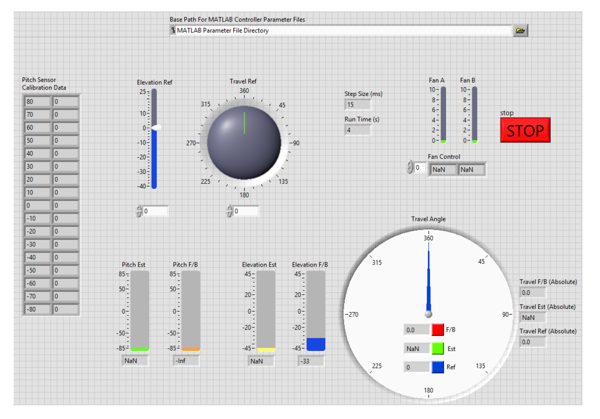

# Hardware-in-the-Loop-Rapid-Control-Prototyping

Link to Video: https://youtu.be/obYV9Oqxw2k

This is an implementation of a full advanced 3-DOF feedback system with a simulation model of a helicopter kit using dSPACE hardware and software platforms along with myDAQ to perform HIL testing, validating control algorithms and ensuring seamless integration between virtual simulations and pyhsical Hardware. Used MATLAB and Simulink for the simulation and LabVIEW for graphical programming and Hardware-in-the-Loop testing

Started with a Dashboard:

Then built and tested an Open Loop Controller on LabVIEW:

Then moved on to design a Closed Loop Controller:

